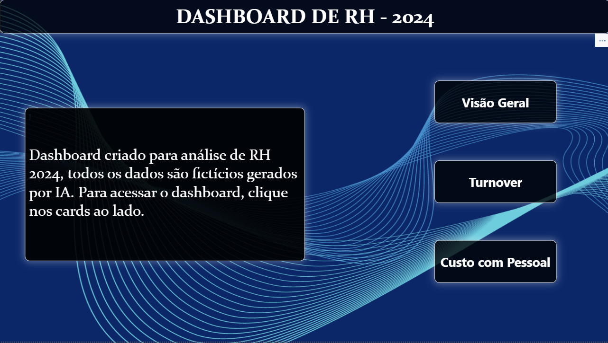
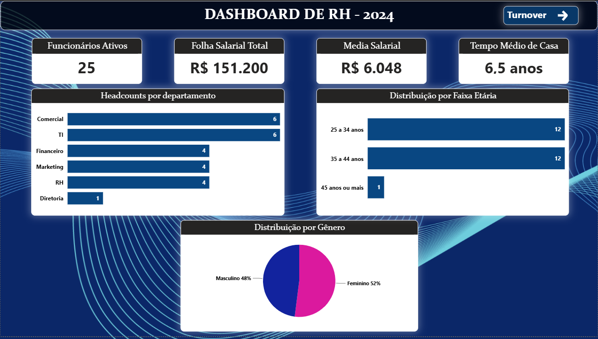
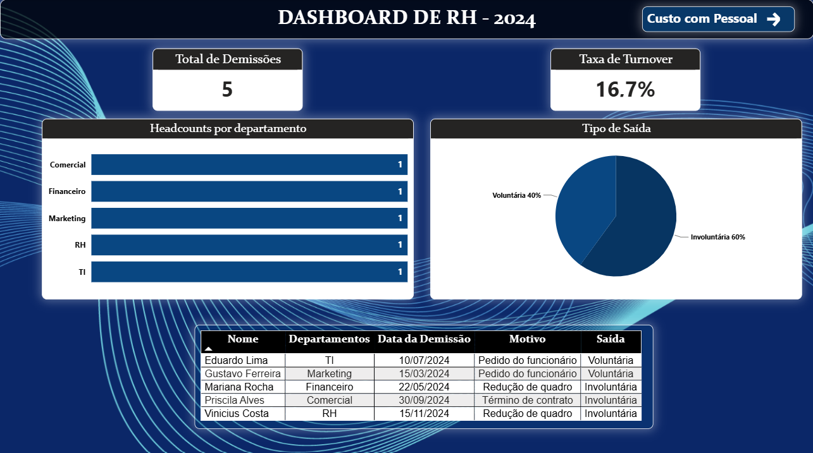
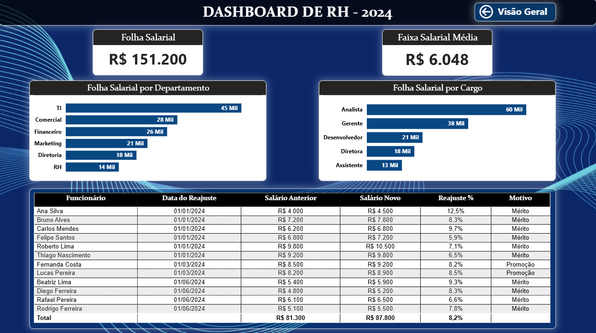

# 👥 Dashboard de RH - 2024

Dashboard de análise de Recursos Humanos desenvolvido com **Excel** e **Power BI**, simulando o ambiente de dados de uma empresa com 30 funcionários.

---

## 🎯 Objetivo do Projeto

Demonstrar análise de dados aplicada à gestão de pessoas, cobrindo:
- Headcount e distribuição de equipes
- Análise de turnover e demissões
- Custo com folha salarial e reajustes

---

## 🖥️ Páginas do Dashboard

### Capa

### Visão Geral

Indicadores principais:
- **Funcionários Ativos:** 25
- **Folha Salarial Total:** R$ 151.200
- **Média Salarial:** R$ 6.048
- **Tempo Médio de Casa:** 6,5 anos

### Turnover

- **Total de Demissões:** 5
- **Taxa de Turnover:** 16,7%
- **60% das saídas** foram involuntárias (redução de quadro)

### Custo com Pessoal

- **TI** é o departamento com maior custo de folha (R$ 45 Mil)
- **Analistas** representam o maior custo por cargo (R$ 60 Mil)
- 12 reajustes realizados em 2024, média de **8,2%**

---

## 🗄️ Fonte de Dados

Arquivo Excel com 3 abas:

| Aba | Descrição |
|-----|-----------|
| `funcionarios` | Cadastro completo dos 30 funcionários |
| `demissoes` | Histórico de 5 demissões com motivo e tipo |
| `historico_salarios` | 12 reajustes salariais realizados em 2024 |

---

## 🛠️ Tecnologias utilizadas

- **Excel** - fonte de dados estruturada
- **Power BI Desktop** - modelagem e visualização
- **DAX** - medidas e colunas calculadas
- **Power Query** - tratamento e tipagem dos dados

---

## 📌 Principais aprendizados

- Conexão de arquivo Excel como fonte de dados no Power BI
- Criação de colunas calculadas com DAX (Idade, Tempo de Casa, Faixas)
- Relacionamento entre tabelas com cardinalidades diferentes
- Análise de turnover e custo com pessoal
- Uso de RELATED() para trazer dados de tabelas relacionadas